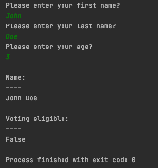

## Assignment 1
### Input Output

Write a python program that
1. Prompts for user first name, last name, and age
2. Then outputs the collected information along with their voting eligibility (age >= 18)

Your program should behave as shown in the attached image.  Should output the correct voting eligibility along with the collected user first name and last name

