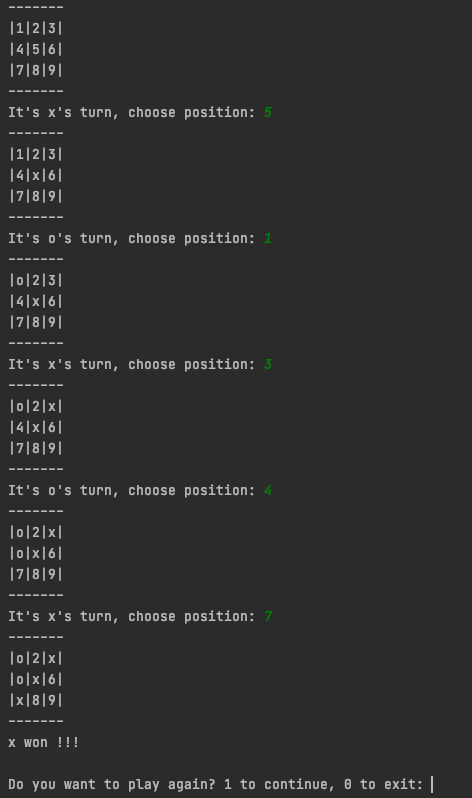
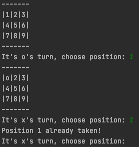
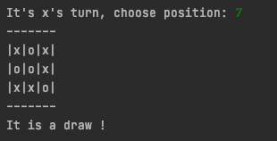

## Assignment 5
### Game of Tic-Tac-Toe

Write a program to play tic-tac-toe.  The program should behave as shown in this screenshot.

* Program should start with printing the board.
* Position 1 is top left. Position 9 is bottom right,  as shown above.
* **x** always starts off first.
* Program should print the board position after each turn.
* Program should alternate between **x** and **o** for each turn.
* If a players chooses a position that is already taken, program should indicate as below and allow 
  player to choose position again until an empty position is chosen
  
* If any player wins, player won prompt should be shown.
* If no player wins after the 9th move, draw should be shown.
  
* Program should prompt user whether they want play again when a game comes to an end (win or draw).
* If player chooses to continue, 1st move should be given to the player who didn't start in the last game.

### Hints

* Use a list of list to represent the board
* Values in the board can be either **1-9** or **x** or **o**
* Write a function to print the board to console `def print_board(board)`
* Write a function to convert position 1-9 into a tuple x, y, 
  such that x, y can be used to index into the board position
* Write a function to determine if a player won `def check_if_player_won(board, player)`
* Write a function to determine if it is a draw `def check_if_draw(board)`.
* Create a `while` loop for the main function.
* Create variables to keep game state: player's turn, board, and previous games 1st move player.

