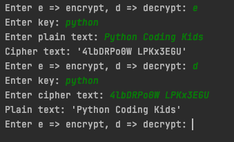
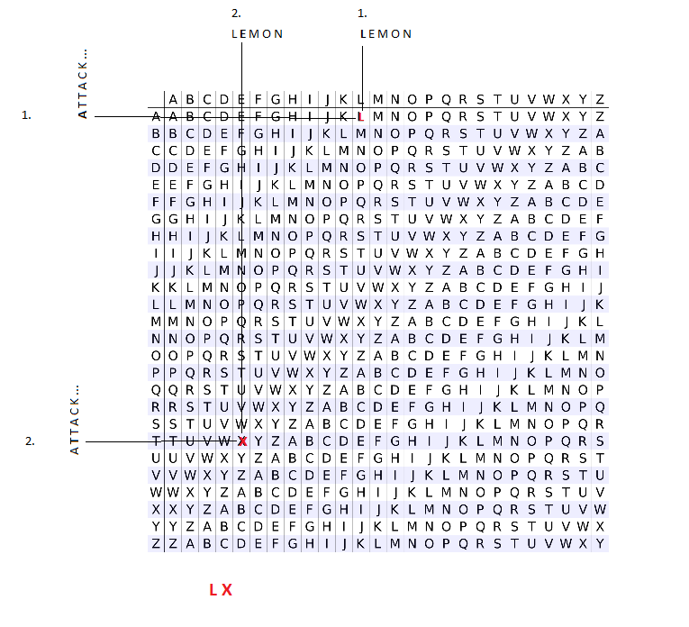

## Assignment 6
### Vigenère cipher

Write a program to encrypt and decrypt a message using the Vigenère cipher.  
The program should behave as shown in the screenshot below.

Unlike the wikipedia example which only contains uppercase alphabets, you must use both upper/lower case letters,
numbers, and space.

To implement the [Vigenère cipher](https://en.wikipedia.org/wiki/Vigen%C3%A8re_cipher), follow the suggested
hints below.

### Hints

* Create a List of List to represent the Vigenère square.
* Initial column can be hard coded.  Subsequent columns can be created by using slicing operator.
* You may use python dictionary to store the mapping between a 'character', and it's index.
* Since the Vigenère square is symmetric, you can use **key** or **plain text** to index into a column or row.
* First try with only uppercase letters to ensure you match the example in wikipedia example, then add the remaining
  lower case characters, numbers, and space
  

