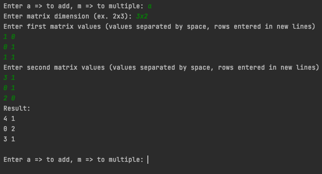
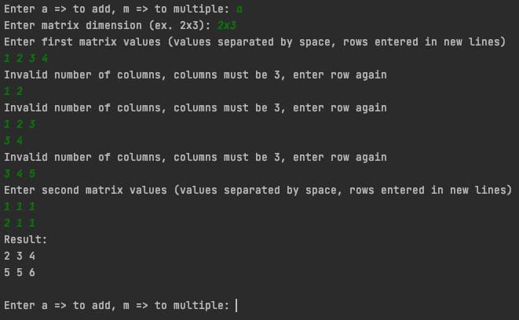
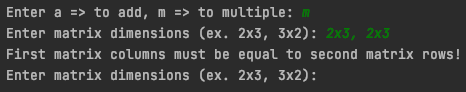

## Assignment 7
### Matrix Addition and Multiplication

Write a program to add or multiply matrices. You may **NOT** use third party
libraries such as *numpy*.

The program should behave as shown in the screenshot below.

#### Addition

In the event the user enters the wrong number of elements for a row, the 
program should warn and allow the user to retry as shown below

#### Multiplication

In the event the user enters the incorrect dimensions for the matrices, the 
program should warn and allow the user to retry as shown below

### Hints

* Similar to our previous assignments, you can represent the matrix as a list of list
* Matrix Addition - https://en.wikipedia.org/wiki/Matrix_addition
* Matrix Multiplication - https://en.wikipedia.org/wiki/Matrix_multiplication

