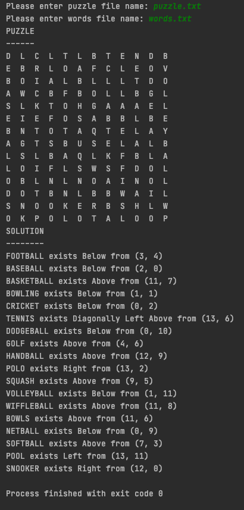

## Assignment 8
### Word Search

In this assignment you will read 2 files as input for your word search puzzle solver
program.

First file contains the word search puzzle, where each line is a row in the puzzle
table.

Second file contain words to be searched, one word per line in the file.

Your program should prompt the user to enter the two file names.  Using those file
names, read the content of the files and solve it.  

Your program should behave as below:

Example [puzzle.txt](puzzle.txt) and [words.txt](words.txt) are given

### Hints

* Represent the table as a list of list.
* For each word in the words file, search from all positions (row, col) as the starting
position of the word in all possible 8 directions 
  (left, right, up, down, and all 4 diagonals) 

