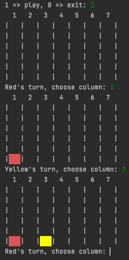
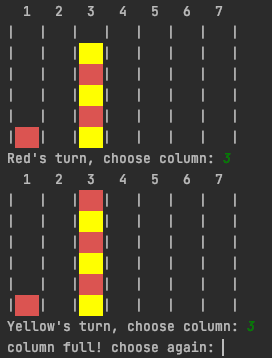
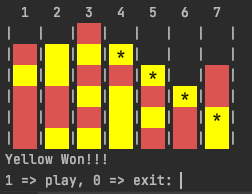
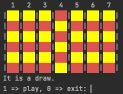

## Assignment 9
### Connect Four

In this assignment you will implement the [Connect Four](https://en.wikipedia.org/wiki/Connect_Four)
game to be played between two people

Your program should behave as below:

1. Print the board
2. Start with RED player
3. Ask to choose the column to drop the disk, if column already full ask user to choose another column
4. Switch turn between RED and YELLOW
5. Print board between each player turn  
6. After each turn check if player won or draw.  
   * If won, indicate player won and display asterisk (*) on the 
    disks on the board that contributed to the win
   * If drawn, indicate draw   
7. When game finishes, prompt to play again or quit
    * If play again, switch starting player from last time

#### Start of play    

#### Prompt if column full

#### Player won

#### Draw

You should use the attached [print_color.py](print_color.py) module to print the red and yellow squares.
This is given as a convenient way for you to print in color.

### Hints

* Represent the game board as a list of list, similar to how the tic-tac-toe game was implemented.
* Each element is a list can be either 'R' for Red, 'Y' for yellow, or '' if position available  
* Checking if a player won requires checking all the positions on the board in all 8 directions (similar to 
  word search problem) for 4 consecutive disks.

